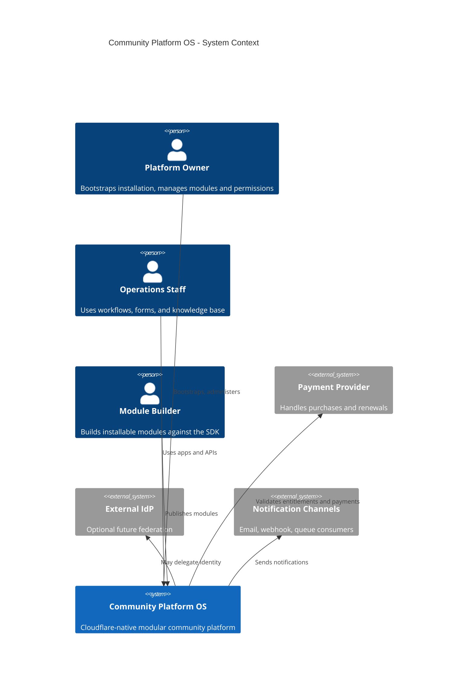
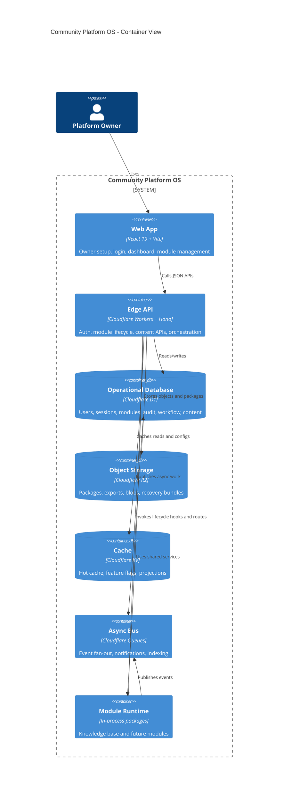
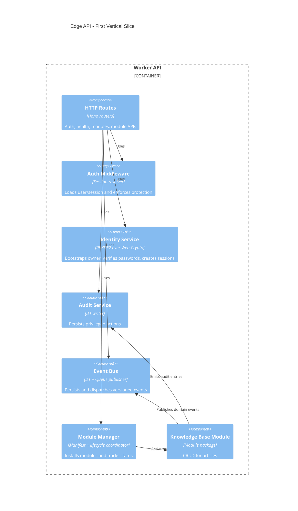

# C4 Diagrams

## Context

```mermaid
C4Context
    title Community Platform OS - System Context
    Person(owner, "Platform Owner", "Bootstraps installation, manages modules and permissions")
    Person(staff, "Operations Staff", "Uses workflows, forms, and knowledge base")
    Person(modBuilder, "Module Builder", "Builds installable modules against the SDK")
    System_Ext(payment, "Payment Provider", "Handles purchases and renewals")
    System_Ext(idp, "External IdP", "Optional future federation")
    System_Ext(notify, "Notification Channels", "Email, webhook, queue consumers")
    System(cpos, "Community Platform OS", "Cloudflare-native modular community platform")
    Rel(owner, cpos, "Bootstraps, administers")
    Rel(staff, cpos, "Uses apps and APIs")
    Rel(modBuilder, cpos, "Publishes modules")
    Rel(cpos, payment, "Validates entitlements and payments")
    Rel(cpos, idp, "May delegate identity")
    Rel(cpos, notify, "Sends notifications")
```

## Container

```mermaid
C4Container
    title Community Platform OS - Container View
    Person(owner, "Platform Owner")
    System_Boundary(cpos, "Community Platform OS") {
        Container(web, "Web App", "React 19 + Vite", "Owner setup, login, dashboard, module management")
        Container(api, "Edge API", "Cloudflare Workers + Hono", "Auth, module lifecycle, content APIs, orchestration")
        ContainerDb(d1, "Operational Database", "Cloudflare D1", "Users, sessions, modules, audit, workflow, content")
        ContainerDb(r2, "Object Storage", "Cloudflare R2", "Packages, exports, blobs, recovery bundles")
        ContainerDb(kv, "Cache", "Cloudflare KV", "Hot cache, feature flags, projections")
        Container(queue, "Async Bus", "Cloudflare Queues", "Event fan-out, notifications, indexing")
        Container(moduleRuntime, "Module Runtime", "In-process packages", "Knowledge base and future modules")
    }
    Rel(owner, web, "Uses")
    Rel(web, api, "Calls JSON APIs")
    Rel(api, d1, "Reads/writes")
    Rel(api, r2, "Stores objects and packages")
    Rel(api, kv, "Caches reads and configs")
    Rel(api, queue, "Publishes async work")
    Rel(api, moduleRuntime, "Invokes lifecycle hooks and routes")
    Rel(moduleRuntime, d1, "Uses shared services")
    Rel(moduleRuntime, queue, "Publishes events")
```

## Component

```mermaid
C4Component
    title Edge API - First Vertical Slice
    Container_Boundary(api, "Worker API") {
        Component(routes, "HTTP Routes", "Hono routers", "Auth, health, modules, module APIs")
        Component(auth, "Auth Middleware", "Session resolver", "Loads user/session and enforces protection")
        Component(identity, "Identity Service", "PBKDF2 over Web Crypto", "Bootstraps owner, verifies passwords, creates sessions")
        Component(audit, "Audit Service", "D1 writer", "Persists privileged actions")
        Component(eventBus, "Event Bus", "D1 + Queue publisher", "Persists and dispatches versioned events")
        Component(moduleManager, "Module Manager", "Manifest + lifecycle coordinator", "Installs modules and tracks status")
        Component(kb, "Knowledge Base Module", "Module package", "CRUD for articles")
    }
    Rel(routes, auth, "Uses")
    Rel(routes, identity, "Uses")
    Rel(routes, audit, "Uses")
    Rel(routes, eventBus, "Uses")
    Rel(routes, moduleManager, "Uses")
    Rel(moduleManager, kb, "Activates")
    Rel(kb, eventBus, "Publishes domain events")
    Rel(kb, audit, "Emits audit entries")
```
