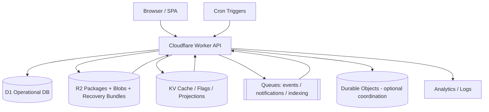

# Cloudflare Deployment Topology

The platform is intentionally Cloudflare-native, but the domain packages remain cloud-portable. Cloudflare handles edge execution and operational primitives; the application still keeps explicit interfaces for data, storage, queueing, identity, and licensing so providers can be swapped later if needed.

## Binding strategy

- **D1:** authoritative relational state for identities, sessions, modules, content metadata, workflow state, and audit/event records.
- **R2:** package archives, content attachments, export bundles, design assets, and recovery artifacts.
- **KV:** low-latency read-through cache for manifests, design tokens, small projections, and feature flags.
- **Queues:** non-blocking delivery for notifications, indexing, reporting, and eventual projections.
- **Durable Objects:** reserved for problems requiring strict single-writer coordination such as distributed locks or workflow step leasing.

## Operational posture

Edge APIs remain stateless. State transitions that must survive retries are recorded in D1 before non-critical fan-out is published to Queues. Recovery bundles combine D1 exports plus R2 object manifests so a full installation can be rehydrated.
