# Domain Model

## Bounded contexts

- **Identity and Access:** Installation, User, Role, Permission, Session, Owner policy.
- **Module Runtime:** Module, ModuleManifest, lifecycle state, module permissions, hooks.
- **Operations:** AuditLog, Event, Notification, Entitlement.
- **Forms and Workflow:** Form, FormField, FormSubmission, WorkflowDefinition, WorkflowState, WorkflowTransition, WorkflowInstance.
- **Content:** ContentItem, ContentRevision, KBArticle.

## Dependency rules

1. Identity and access has no dependency on feature modules.
2. Module runtime depends on identity, audit, eventing, and entitlement interfaces only.
3. Forms, workflow, and content depend on core identities and eventing, but not on knowledge-base specifics.
4. Knowledge base depends on content plus workflow and permission contracts.
5. UI packages can depend on core types, never directly on worker persistence details.
6. Cross-domain communication uses service interfaces or versioned events, never direct table mutation outside a domain service.

## Core ERD

```mermaid
erDiagram
    Installation ||--o{ User : owns
    Installation ||--o{ Module : installs
    Installation ||--o{ AuditLog : records
    Installation ||--o{ Event : emits
    Installation ||--o{ Form : defines
    Installation ||--o{ WorkflowDefinition : configures
    Installation ||--o{ ContentItem : stores
    Installation ||--o{ Entitlement : grants
    User ||--o{ Session : opens
    User }o--o{ Role : assigned
    Role }o--o{ Permission : grants
    Module ||--|| ModuleManifest : described_by
    Form ||--o{ FormField : contains
    Form ||--o{ FormSubmission : receives
    WorkflowDefinition ||--o{ WorkflowState : includes
    WorkflowDefinition ||--o{ WorkflowTransition : allows
    WorkflowDefinition ||--o{ WorkflowInstance : instantiates
    ContentItem ||--o{ ContentRevision : revises
    ContentItem ||--|| KBArticle : specializes

    Installation {
        string id PK
        string slug
        string name
        string status
        datetime createdAt
    }
    User {
        string id PK
        string installationId FK
        string email
        string displayName
        boolean isOwner
        string status
    }
    Role {
        string id PK
        string installationId FK
        string name
        boolean isSystem
    }
    Permission {
        string id PK
        string key
        string resource
        string action
    }
    Session {
        string id PK
        string userId FK
        datetime expiresAt
        datetime revokedAt
    }
    Module {
        string id PK
        string installationId FK
        string name
        string version
        string status
    }
    ModuleManifest {
        string id PK
        string moduleId FK
        string entrypoint
        string packageDigest
        string signature
    }
    AuditLog {
        string id PK
        string installationId FK
        string actorId
        string action
        string outcome
    }
    Event {
        string id PK
        string installationId FK
        string name
        string idempotencyKey
        string traceId
    }
    Form {
        string id PK
        string installationId FK
        string key
        string version
    }
    FormField {
        string id PK
        string formId FK
        string name
        string type
        boolean required
    }
    FormSubmission {
        string id PK
        string formId FK
        string workflowInstanceId FK
        string payloadJson
    }
    WorkflowDefinition {
        string id PK
        string installationId FK
        string key
        string version
    }
    WorkflowState {
        string id PK
        string definitionId FK
        string key
        boolean terminal
    }
    WorkflowTransition {
        string id PK
        string definitionId FK
        string fromStateId FK
        string toStateId FK
        string eventName
    }
    WorkflowInstance {
        string id PK
        string definitionId FK
        string stateId FK
        string subjectType
        string subjectId
    }
    ContentItem {
        string id PK
        string installationId FK
        string type
        string slug
        string locale
        string status
    }
    ContentRevision {
        string id PK
        string contentItemId FK
        integer revisionNumber
        string bodyJson
        boolean published
    }
    KBArticle {
        string id PK
        string contentItemId FK
        string summary
        string category
        boolean discoverable
    }
    Entitlement {
        string id PK
        string installationId FK
        string moduleId FK
        string status
        datetime validUntil
    }
    Notification {
        string id PK
        string installationId FK
        string channel
        string target
        string status
    }
```

